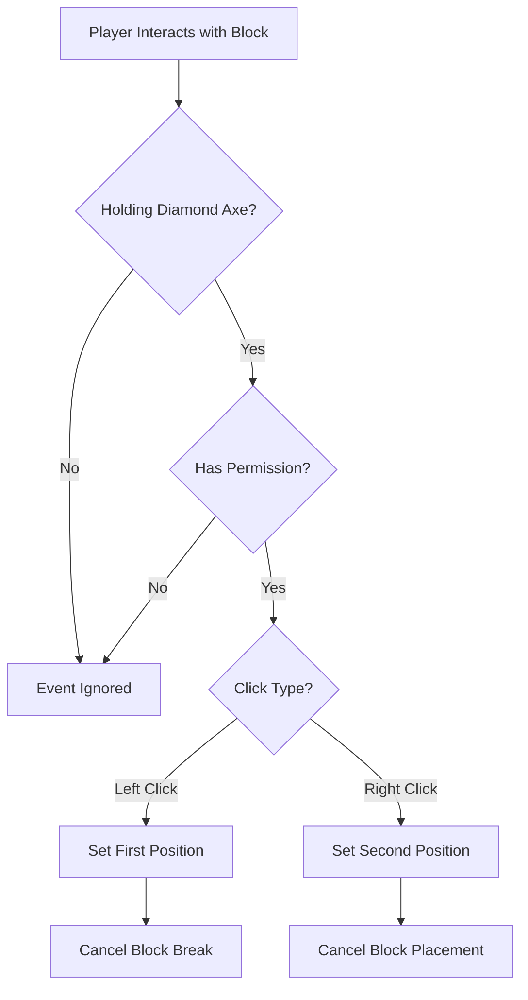
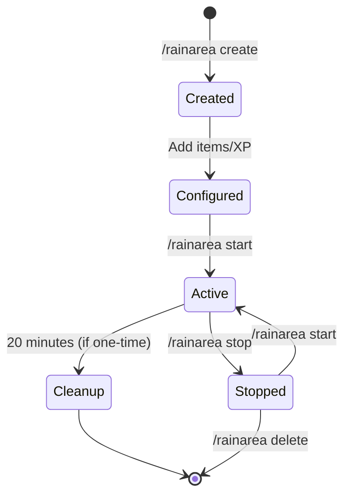

## Overview

RainTools uses Bukkit's event system to handle player interactions for area selection. Understanding these events helps you integrate RainTools with other plugins or customize behavior.

## Listened Events

### PlayerInteractEvent

The primary event used by RainTools for area boundary selection.

<ParamField path="PlayerInteractEvent" type="org.bukkit.event.player.PlayerInteractEvent">
  Fired when a player interacts with blocks in the world. RainTools uses this event to capture area boundary selections made with a diamond axe.
  
  **Listener Class:** `AreaSelectionListener.java`
  
  **Event Priority:** `NORMAL` (default)
</ParamField>

## Area Selection Mechanism

### How Selection Works

RainTools implements a WorldEdit-style area selection system using diamond axes:

1. **Tool Requirement**: Player must hold a diamond axe in their main hand
2. **Permission Check**: Player must have `raintools.area.create` permission
3. **Left Click**: Sets the first position (corner 1)
4. **Right Click**: Sets the second position (corner 2)
5. **Event Cancellation**: Block breaking/placement is prevented during selection

### Selection Flow



## Event Handling Details

### PlayerInteractEvent Handler

**Location:** `AreaSelectionListener.java:21`

```java
@EventHandler
public void onPlayerInteract(PlayerInteractEvent event)
```

#### Event Conditions

The event handler only processes interactions that meet ALL of these conditions:

| Condition | Requirement | Purpose |
|-----------|-------------|----------|
| **Item in Hand** | Diamond Axe | Designates the area selection tool |
| **Permission** | `raintools.area.create` | Restricts selection to authorized players |
| **Action Type** | `LEFT_CLICK_BLOCK` or `RIGHT_CLICK_BLOCK` | Only block interactions (not air clicks) |
| **Clicked Block** | Not null | Ensures valid block target |

#### Action Mapping

<ParamField path="LEFT_CLICK_BLOCK" type="Action">
  Sets the **first position** (corner 1) of the area selection.
  
  **Behavior:**
  - Stores the clicked block's location
  - Cancels block breaking
  - Updates player's selection state
  - Sends confirmation message to player
</ParamField>

<ParamField path="RIGHT_CLICK_BLOCK" type="Action">
  Sets the **second position** (corner 2) of the area selection.
  
  **Behavior:**
  - Stores the clicked block's location
  - Cancels block interaction
  - Updates player's selection state
  - Sends confirmation message to player
</ParamField>

## Area Activation

### Manual Activation

Rain areas do not activate automatically. They must be started manually using commands:

```bash
# Start rain in a specific area
/rainarea start <area_name>

# Stop rain in an area
/rainarea stop <area_name>
```

**Requirements for starting:**
- Area must be fully configured (both positions selected)
- Area must have at least one item or XP configured
- Player must have `raintools.area.manage` permission
- Area must not already be active

### Area Lifecycle



### Entity Cleanup

All dropped items and entities in rain areas are automatically cleaned up after **20 minutes** to prevent server lag.

## Event Integration Examples

### Listening to Area Selection

If you're developing a plugin that integrates with RainTools, you can listen to the same events:

```java
@EventHandler(priority = EventPriority.MONITOR)
public void onAreaSelection(PlayerInteractEvent event) {
    Player player = event.getPlayer();
    
    // Check if event was cancelled by RainTools
    if (event.isCancelled()) {
        ItemStack item = player.getInventory().getItemInMainHand();
        
        // Check if it was RainTools selection
        if (item.getType() == Material.DIAMOND_AXE && 
            player.hasPermission("raintools.area.create")) {
            // Player is selecting RainTools area
            // Your custom logic here
        }
    }
}
```

### Detecting Area Boundaries

You can hook into the area selection process to visualize boundaries:

```java
@EventHandler(priority = EventPriority.MONITOR, ignoreCancelled = false)
public void onPositionSelect(PlayerInteractEvent event) {
    if (!event.isCancelled()) return;
    
    Player player = event.getPlayer();
    ItemStack item = player.getInventory().getItemInMainHand();
    
    if (item.getType() == Material.DIAMOND_AXE) {
        Location loc = event.getClickedBlock().getLocation();
        
        // Show particle effects at selection point
        player.getWorld().spawnParticle(
            Particle.VILLAGER_HAPPY, 
            loc, 
            20
        );
    }
}
```

### Custom Selection Tool

To extend RainTools with a custom selection tool, create a separate listener:

```java
public class CustomSelectionListener implements Listener {
    
    @EventHandler
    public void onCustomToolUse(PlayerInteractEvent event) {
        Player player = event.getPlayer();
        ItemStack item = player.getInventory().getItemInMainHand();
        
        // Use a different tool (e.g., golden axe)
        if (item.getType() != Material.GOLDEN_AXE) return;
        if (!player.hasPermission("raintools.area.create")) return;
        
        if (event.getAction() == Action.LEFT_CLICK_BLOCK) {
            // Your custom first position logic
            event.setCancelled(true);
        }
    }
}
```

## Event Priority Considerations

RainTools uses the default `NORMAL` priority for its event handlers. This means:

- Plugins listening at `LOWEST` or `LOW` priority run first
- RainTools processes the event at `NORMAL` priority
- Plugins at `HIGH` or `HIGHEST` can override RainTools behavior
- Use `MONITOR` priority to observe without interfering

### Priority Levels

| Priority | When to Use | Can Modify Event |
|----------|-------------|------------------|
| **LOWEST** | First chance to handle event | Yes |
| **LOW** | Before most plugins | Yes |
| **NORMAL** | Standard handling (RainTools uses this) | Yes |
| **HIGH** | Override normal handling | Yes |
| **HIGHEST** | Last chance to change outcome | Yes |
| **MONITOR** | Observe only, do not modify | No |

## Troubleshooting

### Selection Not Working

**Problem:** Clicking blocks with diamond axe doesn't select positions

**Possible causes:**
1. Player doesn't have `raintools.area.create` permission
2. Another plugin is cancelling the event at higher priority
3. Player is not holding diamond axe in main hand
4. Clicking air instead of blocks

### Event Conflicts

**Problem:** Another plugin interferes with area selection

**Solutions:**
1. Check event priorities in conflicting plugins
2. Configure the other plugin to ignore diamond axe clicks
3. Use a different selection tool with custom listener
4. Adjust load order in `plugins` folder

### Permission Denied

**Problem:** Event triggers but selection fails silently

**Solution:** Verify the player has `raintools.area.create` permission:
```bash
/lp user <player> permission check raintools.area.create
```